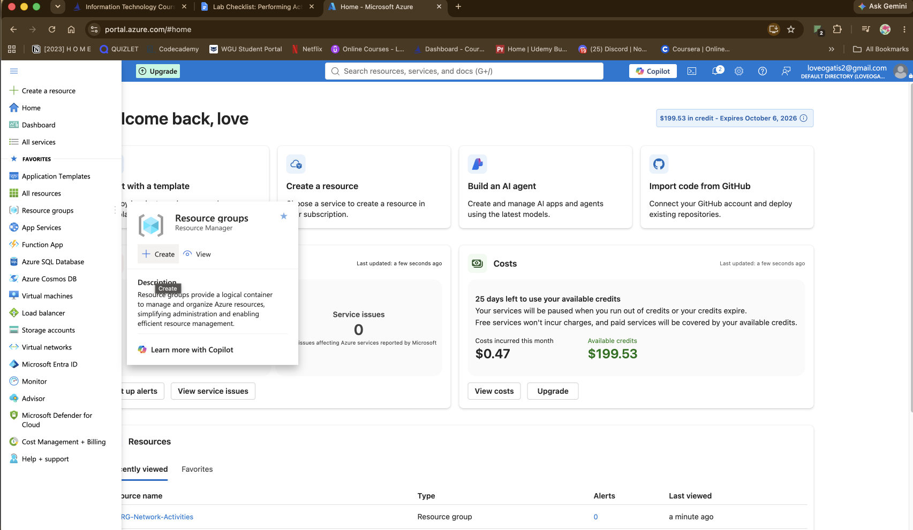
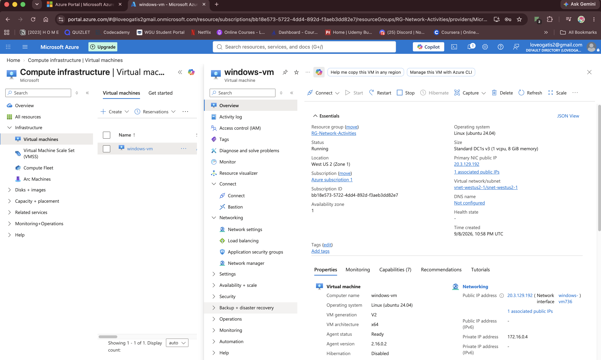
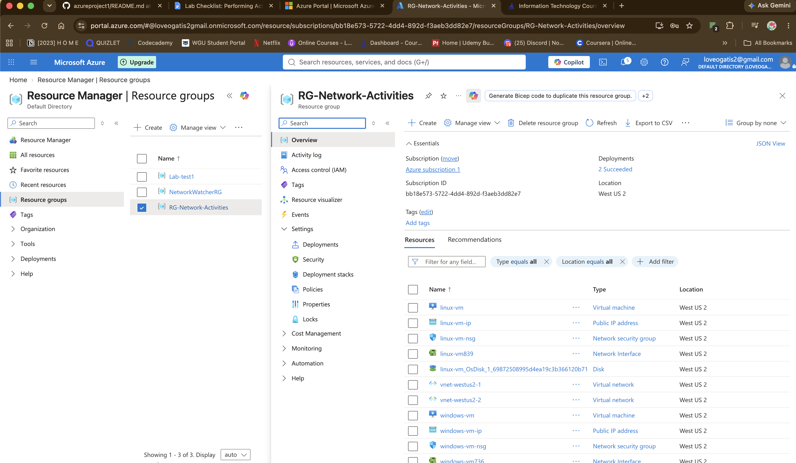
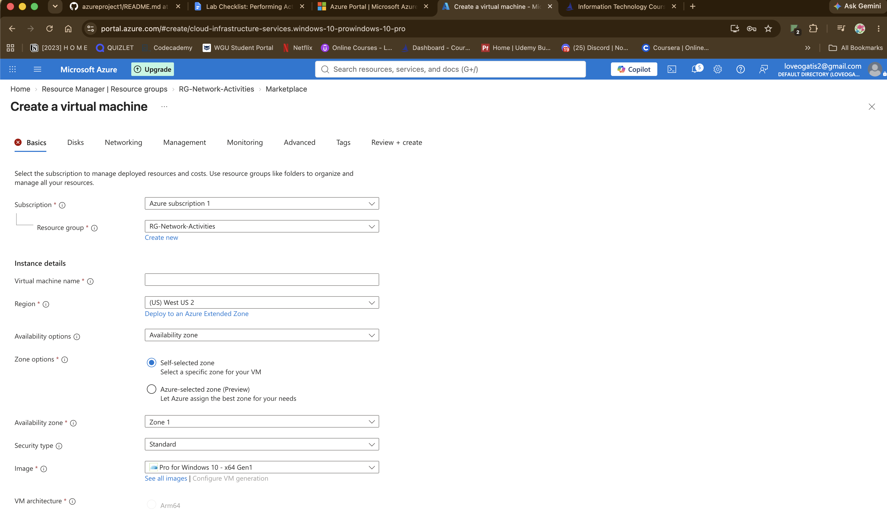

# Azure

# 🚀 Lab: Configure Virtual Machines in Azure
<p align="center"> 
	 
</p>

 📋 Table of Contents
 
- [About the Project](#about-the-project)
- [Features](#features)
- [Getting Started](#getting-started)
- [Next Project](#next-project)
  

## 🔍 About the Project
Configure Virtual Machine in Azure within resource group. Create two Virtual Machines to create a lab where I test ping between VM. 

## ✨ Features
- **Feature 1:** Create a Resource Group.
- **Feature 2:** Create a Windows 10 Virtual Machine(VM).
- **Feature 3:** Create a Linux(Ubuntu)VM.

## 🚀 Getting Started
Provide step-by-step instructions on how to get a local copy of your project up and running.

```bash
Get started Azure here: https://azure.microsoft.com/en-us/pricing/purchase-options/azure-account?icid=get-started&ref=www.google.com&hasfullconsent=true

```


<h3>Step 1: Create Resource Group</h3>

- Under main tab or home tab
	- Hover under Resource Groups > Click Create 

<p align="center"> 
	 
</p> 

<h3>Step 2: Create a Windows 10 Virtual Machine (VM) </h3>

-select the previously created Resource Group

-allow it to create a new Virtual Network (Vnet) and Subnet


<p align="center">
 
</p>

<h3>Step 3: Create a Linux(Ubuntu)VM</h3>
	
-Create a from the same resource group & same network group

<p align="center">
 
</p>

<p align="center">
 
</p>

<h3>Step 3: Recap and Check Virtual Network & Subnet allow</h3>

- Double check both VM's
	- Ensure both are under the same Virtual Network/Subnet

<p align="center">
 
</p>

## 💡 Next Project

Will be observing ICMP Traffic & Configuring Firewall 
